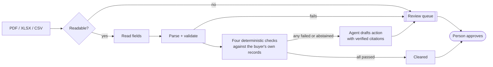

# Countersign

Invoice-to-payment reconciliation with document extraction, deterministic three-way
matching, and an approval-gated agent that recommends but never pays.

**Live console: [countersign-zeta.vercel.app](https://countersign-zeta.vercel.app)** ·
[Try it yourself](https://countersign-zeta.vercel.app/lab/) ·
[API reference](https://countersign-zeta.vercel.app/api/docs) ·
[Evaluation report](eval/report.md)

## Try it

- **Overview** explains what Countersign is, what every number means, and the four checks
  in plain language. Every figure has an explanation behind an info button, and a Help
  panel with a glossary sits in the same place on every page.
- **Review invoices.** Pick an invoice and read what's wrong in one sentence ("the price is
  about 81% higher than this supplier's usual"), the suggested next step and why, the four
  checks, the invoice against the purchase order, and a chart of the supplier's past prices.
  A short, skippable guide explains the screen on a first visit.
- **Decide.** Approve, hold or escalate. The decision is recorded on the server, checked by
  the same state machine as the pipeline, and kept in a decision history you can export.
  Choosing differently from the suggestion requires a written reason; the server refuses it
  otherwise.
- **Try it yourself.** Pick a supplier and a mistake to plant: overbill, overcharge, wrong
  VAT, an inflated order, wrong currency, or a resubmitted invoice. The server creates a
  real PDF and reads it back through the pipeline, then tells you whether it caught the
  mistake. You can also upload your own PDF, XLSX or CSV.

Everything you do lives in your own workspace, carried in the URL, so it can be shared and
nobody else's clicks change yours.

---

## All data in this project is synthetic

There is no real vendor data and no real company data here. Vendors, purchase orders,
deliveries and 500 invoice documents are produced by a seeded generator in
[`data/generate.py`](data/generate.py), reproducible byte for byte from a clone. Vendor
names are assembled from generic word lists; the buyer is fictional. This system has not
been deployed at or for any organisation. Results on this corpus are an upper bound, not a
prediction of performance on real invoices ([dataset card](docs/dataset-card.md)).

---

## The problem

A manufacturing group receives supplier invoices as PDFs and spreadsheets, from dozens of
vendors, in formats that agree on nothing. Someone types each one in. Someone else checks it
against the purchase order and the delivery record, checks the price against what the vendor
usually charges, checks the VAT arithmetic, and checks it has not been paid already. The work
is slow, and the checks skipped when the queue is long are the ones that cost money.

Countersign reads the document, turns it into a typed record, runs the checks a controller
would run, routes anything doubtful to a person, and drafts a recommended action with every
claim linked to the record behind it. A person makes the decision.

## Measured results

From `python -m eval.run` over 500 documents, 90 of them carrying a planted defect. Every
figure comes from the committed files in [`eval/results/`](eval/results/).

| | |
|---|---|
| Planted defects reaching `cleared` | **1 of 90** (target was 0; cause below) |
| False positives on clean invoices | **0.00%** (14.76% before the materiality floor) |
| Cleared with no human input | **71.8%**, and still awaiting an approval to be paid |
| Wrong records persisted by extraction | **9 → 0** with arithmetic validators |
| Strict recall per check | three-way match 97.8%, price variance 100%, duplicate 95.5%, tax 100% |

Extraction here is the **offline reader**, not a language model: 100% on every header field
and 98.2% on line items across four PDF layouts, XLSX and CSV. It reads supplier vocabulary
on a corpus generated from known layouts, so that accuracy is an upper bound, and it is
reported that way. A model can take the same step behind the same contract; it has not been
evaluated yet, and no number here claims it has.

**Manual baseline: not yet measured.** No time-saving claim is made until it is
([eval/manual_baseline.md](eval/manual_baseline.md)).

## What did not work, and what changed

Each of these came out of an evaluation run, and the run that exposed it is kept.

- **The reader silently dropped lines.** In the two layouts with a tax column, long
  descriptions run into the next column. Nine records parsed cleanly and were wrong. The
  subtotal validator now stops all nine; none reach a check.
- **Two companies shared a name.** *Teesta Industries Ltd* and *Teesta Industries
  Corporation* normalise to the same key, because the table strips legal form by design
  ([ADR-004](docs/adr/ADR-004-committed-normalisation-table.md)). That produced 22 false
  positives. Identity is now name plus the printed tax ID; a contradiction goes to a person.
- **Statistically unusual is not money at risk.** On a tight price history, a 2.6% move
  scored thirteen median absolute deviations out. Price variance now also requires a 10%
  material difference. False positives fell from 58 to 0; recall did not move
  ([ADR-003](docs/adr/ADR-003-mad-over-standard-deviation.md)).
- **The corpus was thinner than its own card claimed.** It counted all orders per vendor and
  item, not orders *before* each invoice, so most invoices had too little history and the
  variance check abstained on them. A year of closed historical orders was added from a
  separate random stream, leaving every invoice and ground-truth row byte-identical.
- **The one defect that cleared.** A near-duplicate copied an invoice whose original arrived
  as an image-only scan. With the original unreadable, no rule could see the conflict: the
  copy looked exactly like the missing second half of a split delivery. It is reported, not
  tuned away. `cleared` is not paid, and the next change is to re-run duplicate detection
  over cleared invoices whenever a quarantined document is resolved.

## Where the language model is used, and where it is not

| Layer | How it works | Why |
|---|---|---|
| Document to fields | Reader copies strings as printed; a model can take this step | Unstructured input in per-vendor formats |
| Strings to values | Deterministic parsers, `Decimal`, no floats | A misread number must fail loudly |
| Arithmetic | Validators before anything is stored | Catches wrong-but-plausible extractions |
| Three-way match | Exact comparison with stated tolerances | A controller must recompute it by hand |
| Price variance | Median and MAD, plus a materiality floor | Robust to the outlier it looks for |
| Duplicates | Content hash, per-vendor number, same order and amount | Never a similarity score |
| Tax | Exact recomputation, rates from the order when unprinted | Money is not a float |
| Recommendation | Bounded agent graph over check results, six read-only tools | Reasons about findings; cannot produce or overturn one |
| Payment | A person | There is no code path that pays |

The extraction schema has no field that could mean "approved". A supplier who writes
*"recommend payment"* into a PDF has nothing to set ([threat model](docs/security.md)).

## Architecture



Full detail in [docs/architecture.md](docs/architecture.md). The console is a static
Next.js export; the API is a FastAPI function on Vercel running the same `countersign`
package the evaluation measured. Uploads, lab orders and decisions persist in a private
Vercel Blob store, append-only, one workspace per reviewer
([ADR-007](docs/adr/ADR-007-workspaces-and-append-only-decisions.md)).

## Running it

```bash
make install        # Python venv and dependencies
make corpus         # rebuild the synthetic corpus from the committed seed
make check          # lint, format, 170 tests, migrations, schema drift
make eval           # measure everything; rewrites eval/results and eval/report.md
make web            # export console data and build the static site into web/out
make serve          # console and API together on http://localhost:4321
make deploy         # assemble deploy/ and ship it to Vercel
```

Nothing needs an API key or a network connection: without a Blob token the API keeps
workspaces in memory.

## Documentation

| | |
|---|---|
| [Product requirements](docs/PRD.md) | Problem, users, requirements with build status, targets met and missed |
| [Architecture](docs/architecture.md) | Components, the model boundary, the state machine |
| [Data model](docs/database.md) | Twelve tables, amounts, indexes |
| [Threat model](docs/security.md) | Led by prompt injection through supplier documents |
| [Evaluation](docs/evaluation.md) | The method, written before the first run |
| [Dataset card](docs/dataset-card.md) | The synthetic corpus and its limits |
| [Decisions](docs/adr/) | Seven architecture decision records |
| [Contributing](CONTRIBUTING.md) | Setup and the invariants that are not style preferences |

## Limitations

- The corpus is synthetic, and results on it are an upper bound.
- Extraction is measured for the offline reader only. Model-based extraction is not evaluated.
- No OCR: image-only pages are quarantined, and one of them hid the only defect that cleared.
- The agent's drafting node is a deterministic policy in this release.
- Workspaces are identified by an unguessable link, not an account. Right for a public
  demonstration; production would take the reviewer's identity from single sign-on.
- The deployed API stores decisions in Blob storage, not the PostgreSQL schema in
  `countersign/db`, which is built and migrated but not deployed.
- No rate limiting on the public API.
- Single currency pair. Currency mismatch is detected, not converted.

## Contact

Nurul Azam Bhuiyan · niloybhuiyann@gmail.com · [github.com/Niloy-Bhuiyan](https://github.com/Niloy-Bhuiyan)
