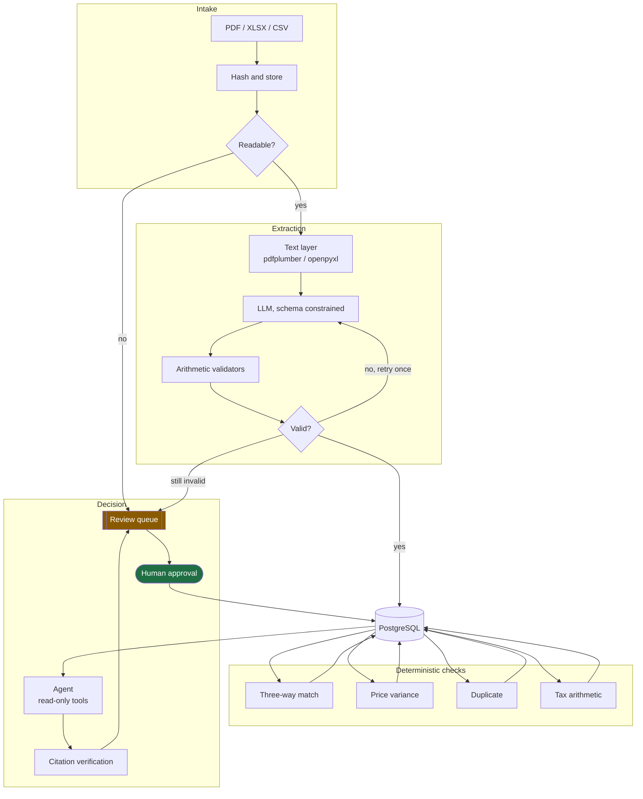
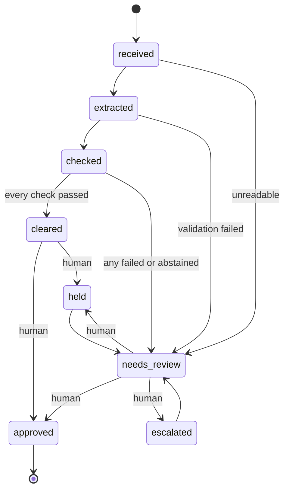
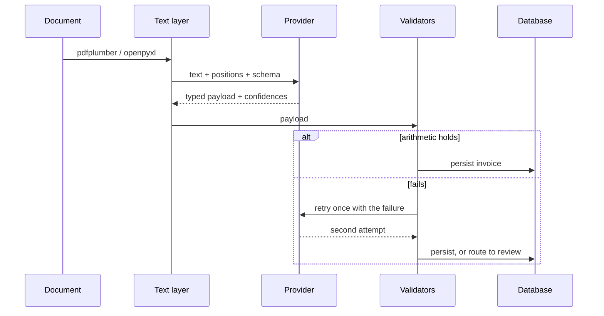
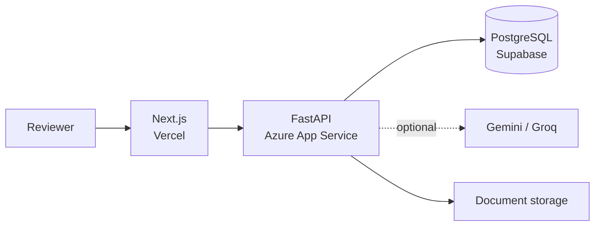

# Architecture

| | |
|---|---|
| **Status** | In development. Component status is marked per section. |
| **Last reviewed** | 2026-09-20 |
| **Decisions** | [adr/](adr/) |

---

## The shape of the system



Two things to read off this diagram:

1. **Every path ends at the review queue or at a human.** There is no edge from any
   automated component to a terminal decision.
2. **The checks read from the database, not from the extractor.** They operate on persisted
   records that already passed validation, so a check result can be recomputed later from
   stored data alone.

## Where the language model is, and is not

This is the central design decision. See [ADR-001](adr/ADR-001-llm-boundary.md).

| Concern | Mechanism | Rationale |
|---|---|---|
| Document → typed fields | LLM, schema-constrained, validated, one bounded retry | Genuinely unstructured input in per-vendor formats |
| Three-way match | pandas, exact comparison with a stated tolerance | A controller must recompute it by hand and agree |
| Price variance | Median + median absolute deviation | Auditable, and robust to the outliers it exists to find ([ADR-003](adr/ADR-003-mad-over-standard-deviation.md)) |
| Duplicate detection | Deterministic keys over a committed normalisation table | Must never be a similarity score ([ADR-004](adr/ADR-004-committed-normalisation-table.md)) |
| Tax arithmetic | `Decimal`, ROUND_HALF_UP, two places | Money is not a float ([ADR-002](adr/ADR-002-decimal-money.md)) |
| Recommended action | LangGraph agent over check results | Reasoning about findings, not producing them |
| Payment | Human | Non-negotiable |

The agent cannot change a check result. It reads them and argues about them.

## Modules

```
countersign/                  application core
  settings.py                 all configuration, offline defaults          [built]
  money.py                    exact decimal arithmetic                     [built]
  states.py                   invoice state machine and its guards         [built]
  vendors.py                  vendor name normalisation table              [built]
  db/
    base.py                   engine, session, NUMERIC type                [built]
    models.py                 vendors, purchase orders, deliveries         [built]
    invoice.py                documents, extractions, invoices             [built]
    audit.py                  check results, recommendations, approvals    [built]
  ingest/                     intake, hashing, quarantine                  [next]
  extraction/                 providers, prompts, validators               [next]
  checks/                     the four deterministic checks                [planned]
  agent/                      tool catalogue and graph                     [planned]
  api/                        FastAPI routes                               [planned]

data/                         synthetic corpus generation
  catalogue.py                vendors and item catalogue                   [built]
  records.py                  purchase orders and deliveries               [built]
  invoices.py                 clean invoice derivation                     [built]
  defects.py                  planted defects and ground truth             [built]
  documents.py                document emission and manifest               [built]
  render/                     four PDF layouts, spreadsheets, mess         [built]
  generate.py                 one seed to the whole corpus                 [built]

eval/                         the evaluation harness                       [planned]
web/                          Next.js review queue and dashboard           [planned]
migrations/                   alembic                                      [built]
```

## Data model

Twelve tables in three groups. Full detail in [database.md](database.md).

- **Reference** — `vendors`, `purchase_orders`, `po_lines`, `deliveries`, `delivery_lines`.
  Treated as given; Countersign never amends them.
- **Derived** — `documents`, `extractions`, `invoices`, `invoice_lines`. Every invoice
  traces back to the file and the extraction run that produced it.
- **Audit** — `check_results`, `recommendations`, `approvals`. Enough on its own to
  reconstruct why any invoice was paid or held.

## The invoice state machine



Enforced in one place, [`countersign/states.py`](../countersign/states.py), and asserted by
ten tests. `transition()` is the only way to change state; services never assign to
`invoice.state`. Two guards:

- `cleared` requires the check outcomes, and every one must be `passed`. An empty run is
  not a pass. An abstention is not a pass — the check declined to judge, which is a reason
  for a person to look.
- `approved`, `held` and `escalated` require `has_approval=True`, which the service layer
  sets only from a stored `approvals` row.

## Extraction pipeline



The provider is a protocol with three implementations: Gemini, Groq, and a deterministic
offline mock that replays committed fixtures. The mock is the default, so the test suite and
a full demo run need no API keys and no network. CI needing a secret would mean the offline
default had broken.

## Deployment



The LLM edge is dotted because it is optional: with the offline provider the system runs
complete without it.

## What this architecture refuses to do

- **No write tool reaches the agent.** Not gated, not permissioned — absent from the
  registry, with a test asserting it.
- **No check result is produced by a model.** A finding a controller cannot recompute is
  not a finding.
- **No float touches money.** Rejected at the money module and again at the database type.
- **No state change bypasses the guard.** One function, ten tests.
