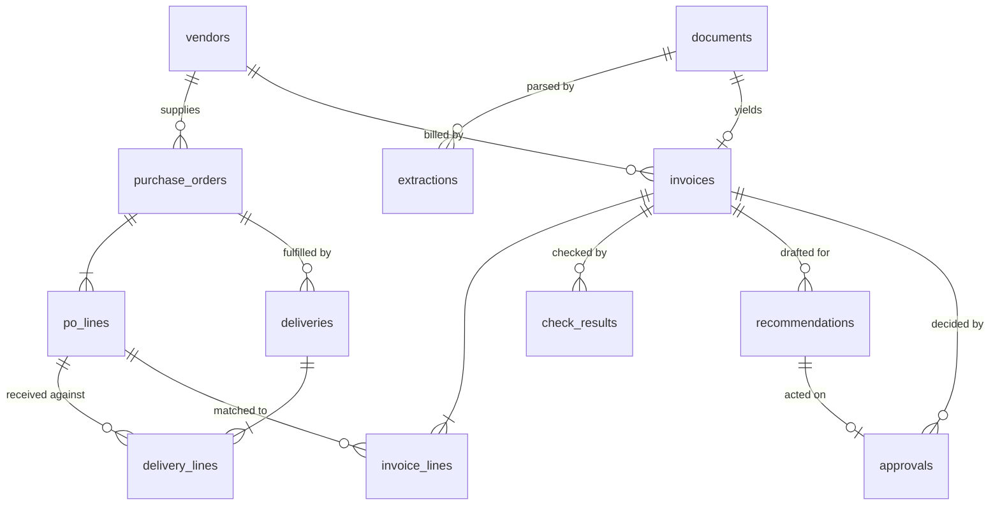

# Data model

| | |
|---|---|
| **Status** | Built. Twelve tables, one alembic migration, `alembic check` reports no drift. |
| **Engine** | PostgreSQL in deployment, SQLite offline. Same schema, same types. |
| **Last reviewed** | 2026-09-20 |

---

## Three groups

**Reference data** — `vendors`, `purchase_orders`, `po_lines`, `deliveries`, `delivery_lines`.
What the buyer already agreed and received. Countersign reads it and never amends it; there
is no code path that writes to these tables outside the corpus generator.

**Derived data** — `documents`, `extractions`, `invoices`, `invoice_lines`. Everything that
came out of a supplier's file. An invoice is never created directly: it is always the parsed
result of a document, so every field traces back to the file and the extraction run behind it.

**Audit** — `check_results`, `recommendations`, `approvals`. Sufficient on their own to
answer "why was this invoice paid or held?" months later, without re-running anything.

## Amounts

Every monetary and quantity column uses a custom `Money` type over `NUMERIC(18, 4)`.

It does two things a plain `Numeric` does not:

- **Refuses a float bind parameter.** Raises rather than storing an inexact value.
- **Returns `Decimal` on SQLite too.** SQLite has no native numeric type and would otherwise
  hand back floats, so the exactness guarantee would hold only in production — which is the
  worst place to discover it does not hold locally.

Four decimal places of storage against two of presentation leaves room for tax computed at a
percentage rate before it is rounded to the money scale. See
[ADR-002](adr/ADR-002-decimal-money.md).

## Invoice state

`invoices.state` is one of `received`, `extracted`, `checked`, `cleared`, `needs_review`,
`approved`, `held`, `escalated`. Transitions are enforced in
[`countersign/states.py`](../countersign/states.py), never by assignment, and never by a
database trigger today — see [ADR-006](adr/ADR-006-single-state-guard.md) for why a trigger is
a deliberate later decision.

The two invariants, both tested:

- `cleared` is reachable only from `checked`, and only when every check outcome is `passed`.
  An empty check run is not a pass; an abstention is not a pass.
- `approved`, `held` and `escalated` require a stored `approvals` row.

## What each audit table carries

**`check_results`** stores `observed`, `expected` and `tolerance` as separate columns rather
than only an outcome. A controller reading a held invoice sees "billed 128.00 against 112.00
delivered, tolerance 0" rather than a severity badge. `evidence_refs` records the rows the
check actually consulted, as `{"table": [ids]}`, so the finding can be reconstructed against
the same inputs.

`outcome` is `passed`, `failed` or `abstained`. Abstention is a first-class outcome: a check
that cannot judge says so, and the state machine treats that as a reason for review rather
than a quiet pass.

**`recommendations`** stores the agent's draft, its `citations` (one per sentence of the
rationale), the `agent_version`, and the `steps_used` and `tool_calls_used` against the
configured caps. A recommendation is inert until an approval references it.

**`approvals`** is the only thing that moves an invoice to a decided state. `decided_by` and
`note` are required when the decision disagrees with the recommendation, so a reviewer
overruling the system leaves a reason behind.

## Indexes

Foreign keys carry indexes. Beyond those:

| Table | Column | Why |
|---|---|---|
| `vendors` | `normalised_name` | Duplicate detection joins on it |
| `documents` | `sha256` (unique) | Identical bytes are one document; the cheapest duplicate signal, before any extraction cost |
| `invoices` | `invoice_number` | Exact-duplicate lookup by vendor and number |
| `invoices` | `state` | The review queue filters on it on every page load |
| `check_results` | `check_code`, `outcome` | Per-check evaluation and the dashboard's frequency breakdown |
| `po_lines` | `sku` | Price history aggregation groups by vendor and SKU |

## Uniqueness, and one deliberate absence

`po_lines` and `invoice_lines` are unique on `(parent_id, line_no)`. `documents.sha256` and
`purchase_orders.po_number` are unique.

`invoices.invoice_number` is **not** unique, and not unique per vendor either. Invoice numbers
are only unique within a supplier's own sequence, and two different suppliers legitimately
issue the same string — the corpus contains exactly that case. Making it a constraint would
reject correct data and would move duplicate detection out of the check layer, where it
belongs with a stated rule and an explanation, into a database error nobody can read.

## Migrations

One migration creates all twelve tables. `make check` runs `alembic upgrade head` followed by
`alembic check`, so a model change without a migration fails CI.

Generated migration scripts are excluded from lint: their style is alembic's, not this
project's. The script template imports `countersign.db.base` so the custom `Money` type
renders into migrations with its module available.
